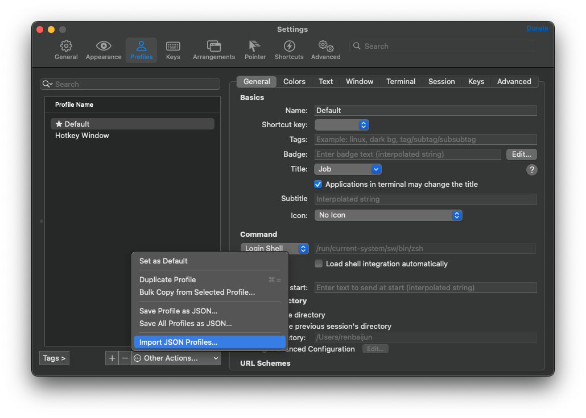

# iTerm2 Profiles

## Import

Unzip the profile:

``` shell
gzip -d Profiles.json.gz
```

In iTerm2, Settings > Profiles > Other Actions > Import JSON Profiles...



## Export

"Save All Profiles as JSON..." at the same place.
