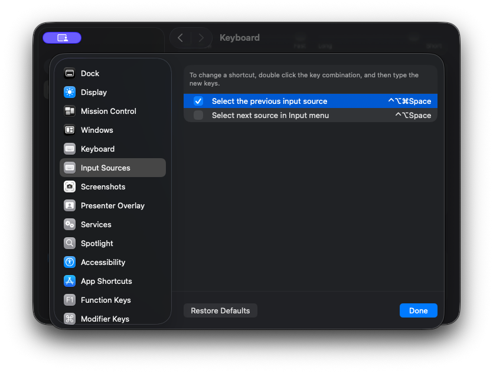

# Karabiner-Elements Profiles

## Import & Export

Refer to [Karabiner-Elements: Export and import configuration](https://karabiner-elements.pqrs.org/docs/manual/operation/export/).

## Explanation

Generally, macOS users switch input sources with `caps_lock`, which is a feature of the builtin input sources of macOS. However, as I'm using third-party input source on macOS, `caps_lock` fails to switch between input sources. Therefore, Karabiner-Element is here to remap `caps_lock` to a more general keybinding for selecting the input source.

This profile remaps `caps_lock` to `⌃⌥⌘Space`, which is the keybinding for "Select the previous input source".

I also remaps `pause` to `fn`, as it's an obsolete key but provided by my HHKB.
